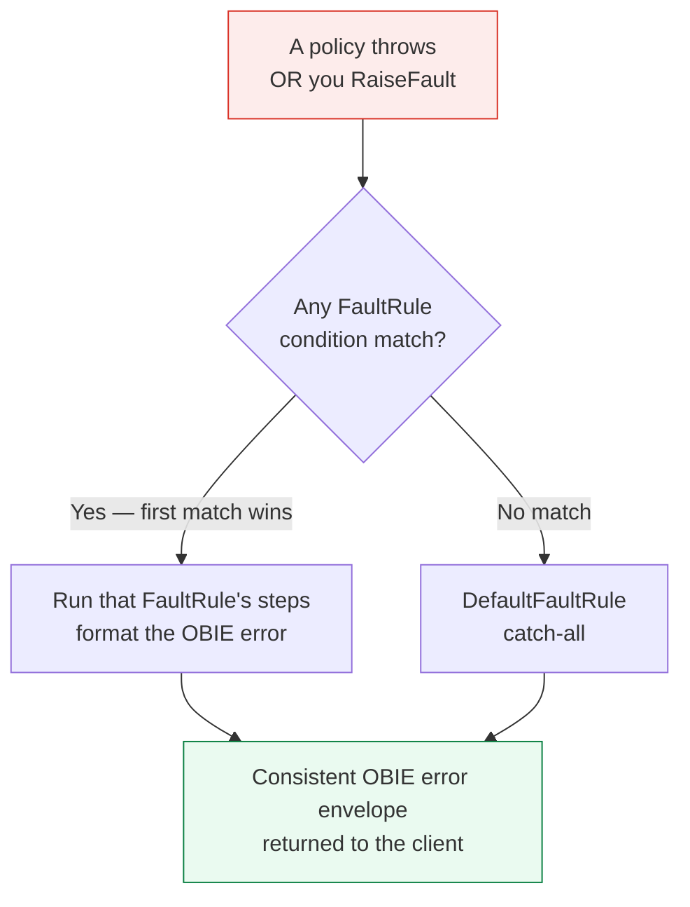

# Day 11 — Fault handling & error taxonomy

> **Bottom line:** You'll throw controlled errors with **RaiseFault**, catch and shape *any* error with **FaultRules** and a **DefaultFaultRule**, and return a consistent OBIE-style error envelope every time.

> **Builds on Day 8 & 9:** you'll reuse `JS-BuildOBError` and finally give the `/health` no-route and funds-check failures proper responses.

## Why this matters

In banking, a vague `500` is a support ticket and a trust problem. TPPs integrate against your **error contract** — the OBIE error format with stable `ErrorCode`s. Apigee's fault system lets you guarantee that contract no matter where the failure happens: a tripped quota, a backend timeout, a validation failure.

## Three mechanisms — know the difference

| Mechanism | Fires when | Lives in |
|-----------|-----------|----------|
| **RaiseFault** | *You* decide to fail (validation, business rule) | A `<Step>` you attach in a flow |
| **FaultRules** | A policy or RaiseFault throws; the matching rule runs | `<FaultRules>` on the ProxyEndpoint/TargetEndpoint |
| **DefaultFaultRule** | Nothing else matched — the catch-all | `<DefaultFaultRule>` on the endpoint |

When an error occurs, Apigee **stops the normal flow** and enters error-handling: it evaluates FaultRules top-to-bottom (first match wins unless `<AlwaysEnforce>`), then the DefaultFaultRule.



## RaiseFault — fail on purpose

```xml
<RaiseFault name="RF-InvalidAmount">
  <DisplayName>RF-InvalidAmount</DisplayName>
  <FaultResponse>
    <Set>
      <StatusCode>400</StatusCode>
      <ReasonPhrase>Bad Request</ReasonPhrase>
    </Set>
  </FaultResponse>
  <!-- seed variables the error builder will read -->
  <AssignVariable><Name>error.obie.code</Name><Value>UK.OBIE.Field.Invalid</Value></AssignVariable>
  <AssignVariable><Name>error.obie.message</Name><Value>InstructedAmount.Amount must be positive.</Value></AssignVariable>
</RaiseFault>
```

Attach it conditionally — e.g. reject a non-positive payment amount:

```xml
<Step>
  <Name>RF-InvalidAmount</Name>
  <Condition>ob.amount LesserThanOrEquals 0</Condition>
</Step>
```

## FaultRules — catch and standardize

Put fault rules on the ProxyEndpoint so they catch errors from anywhere in the request flow. Each rule has a `<Condition>` over the special `fault.name`, policy error variables, and `error.*`.

```xml
<ProxyEndpoint name="default">
  <!-- ... HTTPProxyConnection, Flows, RouteRule ... -->

  <FaultRules>
    <!-- 1. Our own raised faults already set error.obie.*; just format -->
    <FaultRule name="obie-validation">
      <Condition>error.obie.code != null</Condition>
      <Step><Name>JS-BuildOBError</Name></Step>
    </FaultRule>

    <!-- 2. Quota / spike → 429 with a rate-limit error code -->
    <FaultRule name="rate-limited">
      <Condition>(fault.name = "QuotaViolation") or (fault.name = "SpikeArrestViolation")</Condition>
      <Step><Name>AM-RateLimitError</Name></Step>
    </FaultRule>
  </FaultRules>

  <DefaultFaultRule name="catch-all">
    <!-- last line of defence: backend timeouts, unexpected policy errors -->
    <Step><Name>AM-GenericError</Name></Step>
  </DefaultFaultRule>
</ProxyEndpoint>
```

Supporting AssignMessages:

```xml
<AssignMessage name="AM-RateLimitError">
  <Set>
    <StatusCode>429</StatusCode>
    <Payload contentType="application/json">
{"Code":"429 TooManyRequests","Errors":[{"ErrorCode":"UK.OBIE.Rate.Limit","Message":"Rate limit exceeded."}]}
    </Payload>
  </Set>
  <AssignTo createNew="false" type="response">response</AssignTo>
</AssignMessage>
```

```xml
<AssignMessage name="AM-GenericError">
  <Set>
    <StatusCode>500</StatusCode>
    <Payload contentType="application/json">
{"Code":"500 InternalServerError","Id":"{messageid}","Errors":[{"ErrorCode":"UK.OBIE.UnexpectedError","Message":"An unexpected error occurred."}]}
    </Payload>
  </Set>
  <AssignTo createNew="false" type="response">response</AssignTo>
</AssignMessage>
```

> **`continueOnError`:** by default a failing policy enters fault handling. Set `continueOnError="true"` on a policy when a failure is non-fatal (e.g. a logging callout) and you want the flow to keep going. Use sparingly.

## A minimal OBIE error taxonomy

Map internal failures to stable, documented error codes:

| Situation | HTTP | OBIE ErrorCode |
|-----------|------|----------------|
| Missing/!valid field | 400 | `UK.OBIE.Field.Invalid` / `UK.OBIE.Field.Missing` |
| Bad/expired token | 401 | (FAPI/OAuth error) |
| Consent not authorised | 403 | `UK.OBIE.Resource.InvalidConsentStatus` |
| Resource not found | 404 | `UK.OBIE.Resource.NotFound` |
| Rate limited | 429 | `UK.OBIE.Rate.Limit` |
| Unexpected | 500 | `UK.OBIE.UnexpectedError` |

## Lab — guarantee the contract

1. Add `RF-InvalidAmount`, `AM-RateLimitError`, `AM-GenericError` and the FaultRules/DefaultFaultRule block to `proxies/default.xml`.
2. Trigger each path and confirm a consistent envelope:

```bash
apigeecli apis create bundle --name hello-v1 --proxy-folder ./hello-v1/apiproxy --org "$ORG" --token "$TOKEN"
apigeecli apis deploy --name hello-v1 --rev 7 --org "$ORG" --env "$ENV" --ovr --wait --token "$TOKEN"

# validation fault (negative amount)
curl -s -X POST "https://$RUNTIME_HOST/hello-v1/payments" \
  -H 'Content-Type: application/json' \
  -d '{"Data":{"Initiation":{"InstructedAmount":{"Amount":"-5","Currency":"GBP"}}}}' | jq .

# rate limit (burst until SpikeArrest trips)
for i in $(seq 1 8); do curl -s -o /dev/null -w "%{http_code} " -H "x-client-id: t" "https://$RUNTIME_HOST/hello-v1/"; done; echo
```

Every error now returns an OBIE-shaped JSON body — never a raw stack or empty `500`.

## Recap — you can now…

- Throw deliberate errors with **RaiseFault** + conditional steps.
- Catch any error with **FaultRules** and a **DefaultFaultRule**, mapping to a stable taxonomy.
- Return a **consistent OBIE error envelope** for validation, rate-limit, and unexpected failures.

## Check yourself

1. A backend times out. Which mechanism catches it if no FaultRule matches?
2. How do you make a logging policy's failure *not* break the main flow?
3. Two FaultRules match — which runs (default behavior)?

**Next:** Day 12 — Week 2 capstone: pull all this cross-cutting logic into **shared flows** and attach it everywhere with **flow hooks**.
