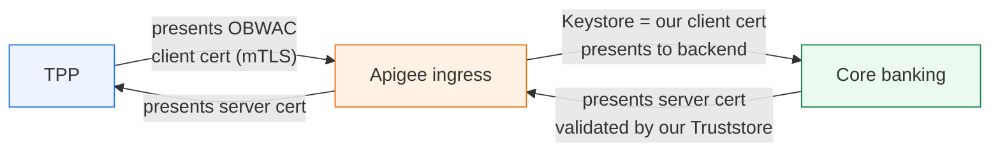

# Day 16 — Transport security: TLS, mTLS & keystores

> **Bottom line:** You'll secure both edges of a proxy — **one-way TLS** for clients and **mutual TLS (mTLS)** for both the TPP→Apigee and Apigee→backend connections — using **keystores** and **truststores**, and expose the client cert for FAPI binding.

> **Builds on Day 15:** the private keys you referenced (`private.signing.key`) live in keystores; mTLS is a hard FAPI requirement (Day 18).

## Why this matters

FAPI 1.0 Advanced **requires mutual TLS** between the TPP and the bank, and Open Banking binds tokens to the client's transport certificate. You also need southbound mTLS to authenticate Apigee to the core banking system. Getting keystores right is non-negotiable in banking.

## The four directions of transport security

```text
        northbound                         southbound
TPP ───────────────► Apigee ───────────────► Core banking
   (1) server TLS: Apigee presents a cert   (3) server TLS: backend presents a cert
   (2) client mTLS: TPP presents a cert     (4) client mTLS: Apigee presents a cert
```



| # | Direction | Who presents a cert | Apigee object |
|---|-----------|---------------------|---------------|
| 1 | Apigee → TPP | Apigee (server) | Managed by Google front end + your env-group hostname cert |
| 2 | TPP → Apigee | TPP (client) | mTLS via the **runtime/ingress**; cert surfaced as a header/var |
| 3 | Backend → Apigee | Backend (server) | **Truststore** on the TargetEndpoint (validate backend cert) |
| 4 | Apigee → Backend | Apigee (client) | **Keystore** on the TargetEndpoint (present client cert) |

## Keystores & truststores

- A **keystore** holds *your* cert + private key (what you present).
- A **truststore** holds the CA/leaf certs you *trust* (what you validate the other side against).

Create a keystore and load a cert+key (southbound client identity for mTLS to the core):

```bash
# 1) create a keystore in the environment
apigeecli keystores create --name core-mtls --org "$ORG" --env "$ENV" --token "$TOKEN"

# 2) generate a demo key pair + CSR (in prod: use your real CA-issued cert)
openssl req -newkey rsa:2048 -nodes -keyout apigee-client.key \
  -x509 -days 365 -out apigee-client.crt \
  -subj "/C=GB/O=Demo Bank/CN=apigee-client"

# 3) upload as a key alias (cert + private key)
apigeecli keyaliases create --keystore core-mtls --name client-alias \
  --format keycertfile --cert ./apigee-client.crt --key ./apigee-client.key \
  --org "$ORG" --env "$ENV" --token "$TOKEN"

# 4) a truststore holding the backend's CA, so we validate the backend's server cert
apigeecli keystores create --name core-truststore --org "$ORG" --env "$ENV" --token "$TOKEN"
apigeecli keyaliases create --keystore core-truststore --name backend-ca \
  --format keycertfile --cert ./backend-ca.crt \
  --org "$ORG" --env "$ENV" --token "$TOKEN"
```

## Southbound mTLS on the TargetEndpoint

Wire the keystore (client identity) and truststore (validate backend) into the TargetEndpoint's `<SSLInfo>`:

```xml
<TargetEndpoint name="default">
  <HTTPTargetConnection>
    <LoadBalancer><Server name="core-banking"/></LoadBalancer>
    <SSLInfo>
      <Enabled>true</Enabled>
      <ClientAuthEnabled>true</ClientAuthEnabled>        <!-- present our client cert -->
      <KeyStore>ref://core-mtls-ref</KeyStore>
      <KeyAlias>client-alias</KeyAlias>
      <TrustStore>ref://core-truststore-ref</TrustStore> <!-- validate backend cert -->
      <IgnoreValidationErrors>false</IgnoreValidationErrors>
    </SSLInfo>
  </HTTPTargetConnection>
</TargetEndpoint>
```

> **Use references, not literal keystore names.** A **reference** (`ref://core-mtls-ref`) is a pointer you can repoint to a new keystore (e.g. after cert rotation) **without redeploying** the proxy. Create one with `apigeecli references create --name core-mtls-ref --refers core-mtls --restype KeyStore ...`. This is how banks rotate certs with zero downtime.

## Northbound mTLS (TPP → Apigee)

Client mTLS at the ingress is configured on the Apigee X **runtime/load-balancer** (the env-group hostname's TLS), not inside the proxy bundle. Once enabled, the TPP's client certificate is surfaced to your proxy as variables/headers so policies can use it — most importantly for **certificate-bound tokens** (Day 24):

```text
tls.client.certificate.subject.dn      ← the TPP cert subject
tls.client.certificate.fingerprint     ← used to bind the token (cnf / x5t#S256)
client.ssl.client.s.dn / ...i.dn       ← subject / issuer DNs
```

A common pattern: validate the cert thumbprint against the token's `cnf` claim:

```xml
<RaiseFault name="RF-CertMismatch">
  <Condition>tls.client.certificate.fingerprint != accesstoken.cnf.x5t</Condition>
  <FaultResponse><Set><StatusCode>401</StatusCode>
    <Payload contentType="application/json">{"error":"invalid_token","error_description":"certificate-bound token mismatch"}</Payload>
  </Set></FaultResponse>
</RaiseFault>
```

## Lab — southbound mTLS + a reference

1. Create `core-mtls` keystore + `client-alias`, and a `core-mtls-ref` reference pointing at it.
2. Add `<SSLInfo>` to your AISP proxy's TargetEndpoint using the reference.
3. Rotate: create `core-mtls-v2`, upload a new alias, then `apigeecli references update --name core-mtls-ref --refers core-mtls-v2 ...` — confirm traffic keeps flowing with **no redeploy**.

```bash
apigeecli references create --name core-mtls-ref --refers core-mtls --restype KeyStore \
  --org "$ORG" --env "$ENV" --token "$TOKEN"
```

## Recap — you can now…

- Map the **four directions** of transport security around a proxy.
- Create **keystores/truststores**, load key aliases, and wire **southbound mTLS** with `<SSLInfo>`.
- Use **references** for zero-downtime cert rotation.
- Read the **TPP client certificate** variables for FAPI token binding.

## Check yourself

1. Keystore vs truststore — which holds *your* private key?
2. Why reference a keystore via `ref://` instead of naming it directly?
3. Which transport edge does FAPI require to be **mutually** authenticated?

**Next:** Day 17 — block bad payloads and lock down the edge: **threat protection, CORS, and data masking**.
