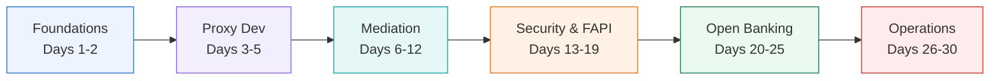

# 30-Day Apigee X Training

> **Bottom line:** In 30 atomic days you go from "never touched Apigee" to shipping a **FAPI-secured UK Open Banking** API surface on **Apigee X** — every day building on the last, every concept covered once and only once.

<p class="lead">A self-paced, copy-paste-driven course for API developers. The throughline is <strong>API proxy development</strong>; the worked domain is <strong>banking and UK Open Banking (OBIE) under the FAPI 1.0 Advanced security profile</strong>.</p>

## How this course is structured

This curriculum follows three rules so it stays learnable:

- **MINTO / pyramid:** every day opens with the *bottom line* — the one thing you'll be able to do — then supports it. Answer first, detail after.
- **MECE:** the five pillars below are **mutually exclusive** (no topic is taught in two places) and **collectively exhaustive** (together they cover "all aspects" of Apigee X relevant to banking).
- **Atomic, but cumulative:** each day is self-contained — one objective, one lab — yet explicitly **builds on** the day before. Skipping is possible but the Open Banking weeks assume the security week.



<div class="pillars">
<div class="pillar-card"><h4>1 · Foundations</h4>Platform, architecture, provisioning, and your toolchain. <em>Days 1–2.</em></div>
<div class="pillar-card"><h4>2 · Proxy Development</h4>Proxies, flows, routing, and the policy execution model. <em>Days 3–5.</em></div>
<div class="pillar-card"><h4>3 · Mediation</h4>Traffic, transformation, composition, caching, faults, reuse. <em>Days 6–12.</em></div>
<div class="pillar-card"><h4>4 · Security &amp; Identity</h4>Keys, OAuth, JWT, mTLS, threats, and FAPI. <em>Days 13–19.</em></div>
<div class="pillar-card"><h4>5 · Open Banking + Ops</h4>Consent, AISP, PISP, DCR, then delivery &amp; production. <em>Days 20–30.</em></div>
</div>

## Explore the 30 days

Filter by pillar, see your progress, and jump straight in. (Your completion ticks are saved in your browser as you mark days done.)

```widget
{"type":"curriculummap"}
```

## What you need

- A Google Cloud account with billing enabled (an Apigee X **evaluation** org is free for 60 days — set up on Day 2).
- Comfort with HTTP, REST, JSON, and the basics of OAuth 2.0. No prior Apigee experience assumed.
- A terminal with `gcloud`, `curl`, and (from Day 2) `apigeecli`. The course installs these.

> Every code block on this site has a **Copy** button. Commands assume `bash`/`zsh`. Replace placeholders like `$PROJECT_ID` and `$ORG` with your own values.

## The 30 days

| Day | Pillar | Topic |
|----:|--------|-------|
| 01 | Foundations | Apigee X: the platform & architecture |
| 02 | Foundations | Provision Apigee X & your toolchain |
| 03 | Proxy Dev | Build & deploy your first API proxy |
| 04 | Proxy Dev | Flows, conditions & routing |
| 05 | Proxy Dev | Policies 101 & the execution model |
| 06 | Mediation | Traffic management: quotas & rate limiting |
| 07 | Mediation | Mediation & variables: AssignMessage + ExtractVariables |
| 08 | Mediation | Transformation with JavaScript & message templates |
| 09 | Mediation | Service composition: ServiceCallout & target servers |
| 10 | Mediation | Caching: response, lookup/populate & KVM |
| 11 | Mediation | Fault handling & error taxonomy |
| 12 | Mediation | Shared flows, flow hooks & reuse — *Week 2 capstone* |
| 13 | Security | App identity: API keys, products, apps & developers |
| 14 | Security | OAuth 2.0: client credentials & token endpoints |
| 15 | Security | OAuth authorization code + PKCE & JWT |
| 16 | Security | Transport security: TLS, mTLS & keystores |
| 17 | Security | Threat protection, CORS & data masking |
| 18 | Security | FAPI 1.0 Advanced: the security profile |
| 19 | Security | Implementing FAPI on Apigee — *Week 3 capstone* |
| 20 | Open Banking | UK Open Banking landscape & trust framework |
| 21 | Open Banking | Consent: the account-access consent model |
| 22 | Open Banking | AISP: account information APIs |
| 23 | Open Banking | PISP: payment initiation APIs |
| 24 | Open Banking | Dynamic Client Registration, SSA & cert-bound tokens |
| 25 | Open Banking | End-to-end Open Banking reference build — *Week 4 capstone* |
| 26 | Operations | Environments, env groups, revisions & config |
| 27 | Operations | CI/CD & config-as-code with apigeecli |
| 28 | Operations | Observability: analytics, logging, tracing & debug |
| 29 | Operations | API products, portal, monetization & API hub |
| 30 | Operations | Production readiness & Open Banking capstone |

---

<small>This is an independent training resource. "Apigee", "Google Cloud", and related marks belong to Google. "Open Banking" specifications belong to the Open Banking Implementation Entity (OBIE). Always validate against the current official specifications before production use.</small>
